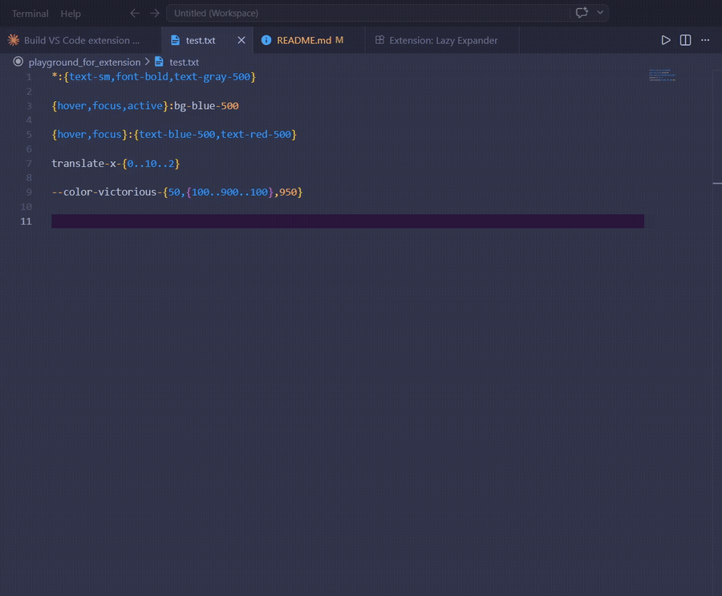
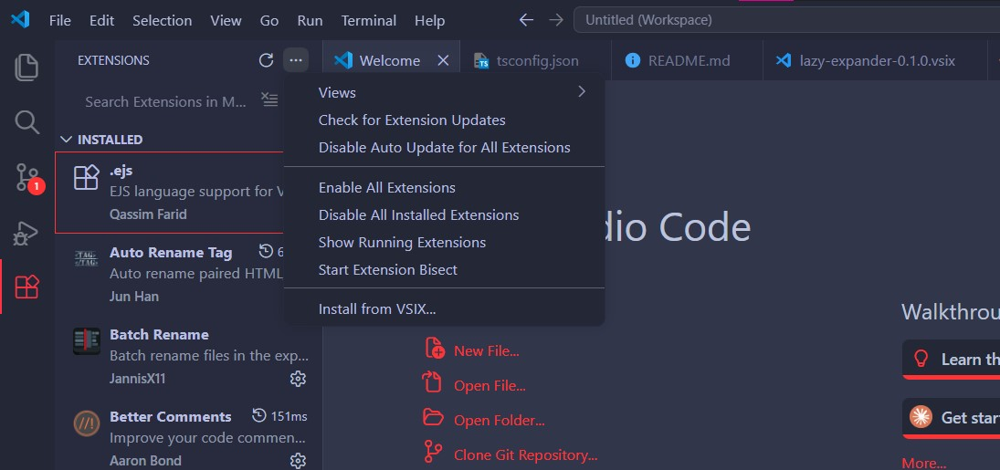

# 🦥 Lazy Expander

Expand brace patterns into multiple values — directly in the editor or copied to clipboard.

Inspired by Tailwind CSS workflows where repeating a prefix for every class gets tedious.



```
input:  *:{text-sm,font-bold,text-gray-500}
output: *:text-sm *:font-bold *:text-gray-500
```

---

## ⚡ Commands

Open the Command Palette (`Ctrl+Shift+P`) and type **Lazy Expander**:

| Command | Output |
|---|---|
| `Lazy Expander: Inline` | `item1 item2 item3` |
| `Lazy Expander: Inline with Separator` | `item1, item2` / `item1 \| item2` / custom |
| `Lazy Expander: Multiple Lines` | `item1` `item2` `item3` (one per line) |
| `Lazy Expander: Multiple Lines Numbered` | `1. item1` `2. item2` / `- item1` `- item2` |

---

## 🖱️ Usage

### Mode 1 — Selection
Select a brace pattern in the editor → run a command → result **replaces the selection**.

### Mode 2 — No Selection
Run a command → type the pattern in the input box → result is **copied to clipboard** 📋.

---

## 🧩 Patterns

### Comma-separated values
```
*:{text-sm,font-bold,text-gray-500}
→  *:text-sm  *:font-bold  *:text-gray-500
```

### Numeric range
```
col-{1..4}
→  col-1  col-2  col-3  col-4
```

### Range with step
```
{0..10..2}
→  0  2  4  6  8  10
```

### Cartesian product (multiple groups)
```
{hover,focus}:text-blue-500
→  hover:text-blue-500  focus:text-blue-500
```

---

## ✂️ Separator Options (Inline with Separator)

| Option | Value |
|---|---|
| Comma | `, ` |
| Pipe | ` \| ` |
| Semicolon | `; ` |
| Slash | ` / ` |
| Tab | `\t` |
| ✏️ Custom... | Type your own |

---

## 🔢 Numbering Options (Multiple Lines Numbered)

| Option | Example output |
|---|---|
| 0 to X | `0. item` `1. item` `2. item` |
| 1 to X | `1. item` `2. item` `3. item` |
| a to x | `a. item` `b. item` `c. item` |
| A to X | `A. item` `B. item` `C. item` |
| - Bullet | `- item` `- item` `- item` |

> 💡 Spaces around commas are trimmed automatically — `*:{ text-sm , font-bold }` works the same as `*:{text-sm,font-bold}`.

---

## 📦 Installation

### From VS Code Marketplace
Search **Lazy Expander** in the Extensions panel (`Ctrl+Shift+X`).

### From GitHub Releases
1. Download the latest `.vsix` from [Releases](../../releases)
2. Open VS Code → Extensions panel (`Ctrl+Shift+X`)
3. Click `···` (top right) → **Install from VSIX...**
4. Select the downloaded `.vsix` file



Or via terminal:
```
code --install-extension lazy-expander-0.1.0.vsix
```

---

## 📄 License

MIT
